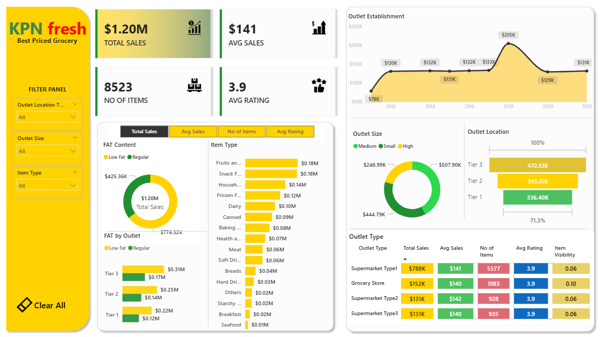

# 📊 KPN Fresh Data Analysis

## 📌 Project Overview

This project focuses on analyzing the **KPN Fresh App dataset** to extract meaningful insights related to business performance and trends.

The analysis is performed using **Power BI**, leveraging data transformation and visualization techniques to support data-driven decision-making.

---

## 🎯 Objectives

* Analyze business data to uncover trends and patterns
* Identify key performance indicators (KPIs)
* Generate insights for better decision-making
* Build interactive and visual reports

---

## 🛠️ Tools & Technologies

* Power BI
* Power Query (Data Transformation)
* Data Visualization
* Excel / CSV Dataset

---

## 🔄 Data Transformation

Data was prepared and transformed using Power Query in Power BI to ensure consistency and usability for analysis.

---

## 📊 Analysis Performed

* Exploratory Data Analysis (EDA)
* Trend Analysis
* KPI-based Analysis
* Interactive Data Visualization

---

## 📈 Key Insights

* Identified important patterns and trends in the dataset
* Highlighted key performance areas
* Provided insights to support business decisions

---

## 📸 Project Preview



---

## 📁 Project Structure

```id="m8s0gk"
📂 KPN_fresh_analysis
 ┣ 📂 dataset
 ┣ 📂 business requirements
 ┣ 📜 dashboard.pbix
 ┣ 📜 README.md
```

---

## 🚀 How to Use

1. Download the `.pbix` file
2. Open in Power BI Desktop
3. Explore the dashboard and insights

---

## 💡 Business Value

* Enables better understanding of business performance
* Supports data-driven decision-making
* Demonstrates practical data analysis and visualization skills

---

## 👤 Author

**Abhishek Nalkande**
GitHub: https://github.com/Abhi-1445

---

## ⭐ If you like this project

Give it a ⭐ on GitHub!
